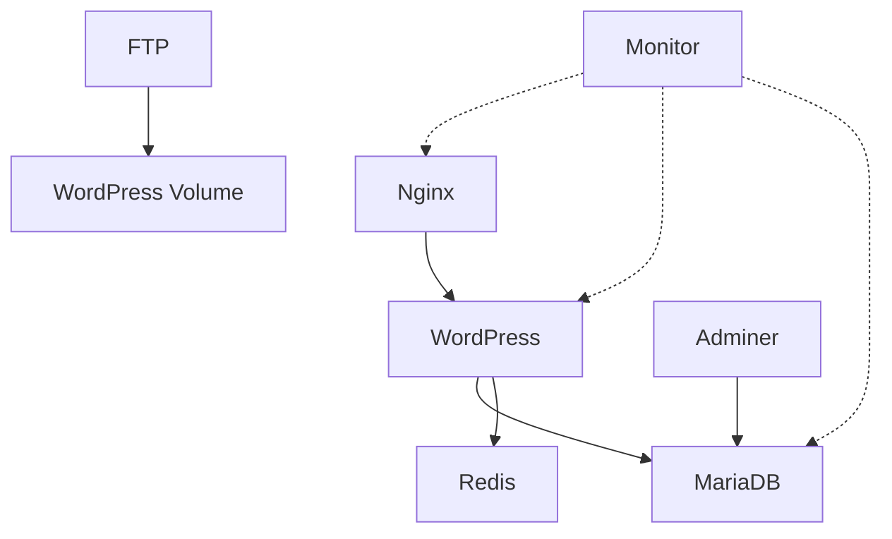

# Developer Documentation

*Inception Project - Technical Guide*

## Table of Contents

1. [Introduction](#introduction)
2. [Environment Setup](#environment-setup)
3. [Project Structure](#project-structure)
4. [Building and Launching](#building-and-launching)
5. [Container Management](#container-management)
6. [Volume Management](#volume-management)
7. [Network Configuration](#network-configuration)
8. [Data Persistence](#data-persistence)
9. [Development Workflow](#development-workflow)
10. [Debugging and Logs](#debugging-and-logs)
11. [Advanced Operations](#advanced-operations)
12. [Architecture Details](#architecture-details)

---

## Introduction

This document provides comprehensive technical information for developers working on the Inception project. It covers environment setup, architecture, container orchestration, and development best practices.

**Target Audience**: Developers, DevOps engineers, and system administrators who need to understand, modify, or extend the infrastructure.

**Prerequisites Knowledge**:
- Docker and containerization concepts
- Docker Compose orchestration
- Linux system administration
- Networking basics (TCP/IP, DNS, ports)
- Shell scripting (Bash/Zsh)

---

## Environment Setup

### Prerequisites Installation

#### 1. Docker Engine

**Linux (Debian/Ubuntu)**:
```bash
# Update package index
sudo apt-get update

# Install dependencies
sudo apt-get install -y ca-certificates curl gnupg lsb-release

# Add Docker's official GPG key
sudo mkdir -p /etc/apt/keyrings
curl -fsSL https://download.docker.com/linux/ubuntu/gpg | sudo gpg --dearmor -o /etc/apt/keyrings/docker.gpg

# Set up repository
echo "deb [arch=$(dpkg --print-architecture) signed-by=/etc/apt/keyrings/docker.gpg] https://download.docker.com/linux/ubuntu $(lsb_release -cs) stable" | sudo tee /etc/apt/sources.list.d/docker.list > /dev/null

# Install Docker Engine
sudo apt-get update
sudo apt-get install -y docker-ce docker-ce-cli containerd.io docker-compose-plugin

# Add user to docker group (avoid sudo)
sudo usermod -aG docker $USER
newgrp docker
```

**macOS**:
```bash
# Using Homebrew
brew install --cask docker

# Or download Docker Desktop from:
# https://www.docker.com/products/docker-desktop
```

**Verify installation**:
```bash
docker --version
docker compose version
```

Expected output:
```
Docker version 24.0.0 or higher
Docker Compose version v2.20.0 or higher
```

#### 2. Additional Tools

```bash
# Make utility (usually pre-installed)
sudo apt-get install -y make

# Git (for version control)
sudo apt-get install -y git

# Text editor (optional but recommended)
sudo apt-get install -y vim nano

# Network debugging tools
sudo apt-get install -y net-tools curl wget
```

### Initial Project Setup

#### 1. Clone the Repository

```bash
git clone <repository-url> inception
cd inception
```

#### 2. Configure Environment Variables

Create the `.env` file in the `srcs/` directory:

```bash
cd srcs
touch .env
```

**Minimal required configuration** (`srcs/.env`):

```bash
# Domain Configuration
DOMAIN_NAME=yourdomain.42.fr

# MariaDB Root Configuration
MYSQL_ROOT_PASSWORD=secure_root_password_here

# MariaDB Database Configuration
MYSQL_DATABASE=wordpress
MYSQL_USER=wordpress_user
MYSQL_PASSWORD=secure_db_password_here

# WordPress Configuration
WP_TITLE=My Inception Site
WP_ADMIN_USER=admin
WP_ADMIN_PASSWORD=secure_admin_password_here
WP_ADMIN_EMAIL=admin@example.com

# WordPress Regular User
WP_USER=editor
WP_USER_EMAIL=editor@example.com
WP_USER_PASSWORD=secure_user_password_here

# FTP Configuration
FTP_USER=ftpuser
FTP_PASSWORD=secure_ftp_password_here

# System User (automatically set)
USER=${USER}
```

**Security best practices for .env**:
```bash
# Set restrictive permissions
chmod 600 srcs/.env

# Ensure .env is in .gitignore
echo "srcs/.env" >> .gitignore

# Create .env.example for documentation
cp srcs/.env srcs/.env.example
# Edit .env.example to remove actual passwords
```

#### 3. Configure Hosts File

Add domain resolution to `/etc/hosts`:

```bash
# For local development
sudo sh -c 'echo "127.0.0.1 yourdomain.42.fr" >> /etc/hosts'

# Verify
cat /etc/hosts | grep yourdomain
```

#### 4. Verify Prerequisites

```bash
# Check Docker
docker info

# Check Docker Compose
docker compose version

# Check Make
make --version

# Check available disk space (need ~10GB)
df -h

# Check available memory (need ~4GB)
free -h
```

---

## Project Structure

### Directory Tree

```
inception/
├── Makefile                          # Build automation
├── README.md                         # Project overview
├── USER_DOC.md                      # User documentation
├── DEV_DOC.md                       # This file
├── guide.tldr                       # Visual guide (tldraw)
└── srcs/                            # Main source directory
    ├── .env                         # Environment variables (not in git)
    ├── docker-compose.yml           # Service orchestration
    └── requirements/                # Service definitions
        ├── nginx/                   # Web server
        │   ├── Dockerfile
        │   ├── conf/
        │   │   └── default.conf     # Nginx configuration
        │   └── tools/
        │       └── init_ssl_certificat.sh
        ├── mariadb/                 # Database server
        │   ├── Dockerfile
        │   └── config/
        │       └── init.sh          # Database initialization
        ├── wordpress/               # PHP-FPM + WordPress
        │   ├── Dockerfile
        │   ├── conf/
        │   │   └── www.conf         # PHP-FPM pool configuration
        │   └── tools/
        │       └── script.sh        # WordPress setup script
        └── bonus/                   # Additional services
            ├── redis/               # Cache server
            │   ├── Dockerfile
            │   └── config/
            │       └── redis.conf
            ├── ftp/                 # FTP server
            │   ├── Dockerfile
            │   ├── conf/
            │   │   └── ftp.conf
            │   └── tools/
            │       └── ftp.sh
            ├── adminer/             # Database UI
            │   └── Dockerfile
            ├── static_website/      # Static site
            │   ├── Dockerfile
            │   └── app/
            │       ├── index.html
            │       ├── style.css
            │       └── script.js
            └── monitor/             # Monitoring dashboard
                ├── Dockerfile
                ├── app/
                │   ├── monitor.py
                │   └── templates/
                │       └── dashboard.html
                └── tools/
                    ├── requirements.txt
                    └── start-monitor.sh
```

### Key Files Explained

#### Makefile

Automates common operations:
- `all`: Creates data directories and builds/starts all services
- `down`: Stops containers without removing volumes
- `clean`: Stops and removes containers and volumes
- `fclean`: Complete cleanup including images and data
- `re`: Full rebuild (fclean + all)

#### docker-compose.yml

Orchestration file defining:
- Service definitions (images, builds, ports)
- Dependencies between services
- Network configuration
- Volume mounts
- Environment variable injection
- Restart policies

#### Dockerfiles

Each service has a Dockerfile that:
- Defines base image (Debian 12)
- Installs required packages
- Copies configuration files
- Sets up entrypoint scripts
- Exposes necessary ports

---

## Building and Launching

### Using the Makefile

The Makefile provides convenient commands for common operations.

#### Build and Start Everything

```bash
make
```

**What this does**:
1. Creates host directories: `/home/$USER/data/wordpress` and `/home/$USER/data/mariadb`
2. Executes: `docker compose -f srcs/docker-compose.yml up --build -d`
3. Builds images for all services
4. Creates network and volumes
5. Starts containers in detached mode

**Expected output**:
```
[+] Building 123.4s (45/45) FINISHED
[+] Running 9/9
 ✔ Network inception          Created
 ✔ Volume mariadb            Created
 ✔ Volume wordpress          Created
 ✔ Container mariadb         Started
 ✔ Container redis           Started
 ✔ Container wordpress       Started
 ✔ Container nginx           Started
 ✔ Container ftp             Started
 ...
```

#### Stop Services (Keep Data)

```bash
make down
```

**What this does**:
- Stops all running containers
- Removes containers
- Keeps volumes intact (data persists)
- Keeps images for faster restart

#### Clean Everything

```bash
make clean
```

**What this does**:
- Stops containers
- Removes containers
- Removes volumes (data is deleted)
- Removes orphaned containers

#### Full Clean (Including Images)

```bash
make fclean
```

**What this does**:
- Everything in `make clean`
- Removes all built images
- Prunes Docker system (removes unused resources)
- Deletes host data directories
- Frees maximum disk space

⚠️ **Warning**: This deletes everything. You'll need to rebuild from scratch.

#### Rebuild from Scratch

```bash
make re
```

Equivalent to: `make fclean && make`

### Using Docker Compose Directly

For more control, use Docker Compose commands directly.

#### Build Images

```bash
# Build all images
docker compose -f srcs/docker-compose.yml build

# Build specific service
docker compose -f srcs/docker-compose.yml build nginx

# Build without cache (force complete rebuild)
docker compose -f srcs/docker-compose.yml build --no-cache

# Build with progress output
docker compose -f srcs/docker-compose.yml build --progress=plain
```

#### Start Services

```bash
# Start all services in detached mode
docker compose -f srcs/docker-compose.yml up -d

# Start specific services
docker compose -f srcs/docker-compose.yml up -d nginx wordpress mariadb

# Start with logs attached (foreground)
docker compose -f srcs/docker-compose.yml up

# Start and rebuild if needed
docker compose -f srcs/docker-compose.yml up -d --build
```

#### Stop Services

```bash
# Stop all services
docker compose -f srcs/docker-compose.yml stop

# Stop specific service
docker compose -f srcs/docker-compose.yml stop wordpress

# Stop and remove containers
docker compose -f srcs/docker-compose.yml down

# Stop and remove containers + volumes
docker compose -f srcs/docker-compose.yml down -v

# Stop and remove containers + volumes + images
docker compose -f srcs/docker-compose.yml down -v --rmi all
```

---

## Container Management

### Basic Container Operations

#### List Containers

```bash
# List running containers
docker ps

# List all containers (including stopped)
docker ps -a

# List with specific format
docker ps --format "table {{.Names}}\t{{.Status}}\t{{.Ports}}"

# Filter by project
docker ps --filter "name=inception"
```

#### Start/Stop Individual Containers

```bash
# Start a stopped container
docker start nginx

# Stop a running container
docker stop wordpress

# Restart a container
docker restart mariadb

# Pause a container (freeze processes)
docker pause redis

# Unpause a container
docker unpause redis
```

#### Execute Commands in Containers

```bash
# Open bash shell in container
docker exec -it wordpress bash

# Run command as root
docker exec -it -u root wordpress bash

# Execute single command
docker exec wordpress ls -la /var/www/html

# Execute with environment variables
docker exec -e TEST_VAR=value wordpress env
```

#### Inspect Container Details

```bash
# View full container configuration
docker inspect wordpress

# Get specific information (JSON query)
docker inspect -f '{{.State.Status}}' wordpress
docker inspect -f '{{range .NetworkSettings.Networks}}{{.IPAddress}}{{end}}' wordpress
docker inspect -f '{{.Config.Env}}' wordpress

# View container statistics
docker stats wordpress

# View container processes
docker top wordpress
```

#### Copy Files To/From Containers

```bash
# Copy from host to container
docker cp local-file.txt wordpress:/var/www/html/

# Copy from container to host
docker cp wordpress:/var/www/html/wp-config.php ./

# Copy directory recursively
docker cp ./themes/ wordpress:/var/www/html/wp-content/
```

### Container Lifecycle Management

#### Understanding Container States

- **Created**: Container created but not started
- **Running**: Container is executing
- **Paused**: Container processes are frozen
- **Restarting**: Container is restarting
- **Exited**: Container stopped (with exit code)
- **Dead**: Container cannot be removed

#### Restart Policies

Defined in docker-compose.yml:
```yaml
restart: on-failure  # Restart only on failure
restart: always      # Always restart
restart: unless-stopped  # Restart unless manually stopped
restart: "no"        # Never restart
```

#### Viewing Container Changes

```bash
# View filesystem changes in container
docker diff wordpress

# A = Added, D = Deleted, C = Changed
```

---

## Volume Management

### Understanding Volumes in This Project

The project uses **named volumes with bind mounts** - a hybrid approach combining Docker volume management with host filesystem access.

#### Volume Configuration

In `docker-compose.yml`:
```yaml
volumes:
  mariadb:
    name: mariadb
    driver: local
    driver_opts:
      type: "none"
      o: "bind"
      device: "/home/${USER}/data/mariadb"

  wordpress:
    name: wordpress
    driver: local
    driver_opts:
      type: "none"
      o: "bind"
      device: "/home/${USER}/data/wordpress"
```

**What this means**:
- Docker manages volumes named `mariadb` and `wordpress`
- Data is physically stored on host at `/home/$USER/data/`
- Accessible both through Docker commands and direct filesystem access

### Volume Operations

#### List Volumes

```bash
# List all volumes
docker volume ls

# List volumes with filters
docker volume ls --filter "name=wordpress"

# List dangling volumes (not attached to containers)
docker volume ls --filter "dangling=true"
```

#### Inspect Volumes

```bash
# View volume details
docker volume inspect wordpress

# Get mount point
docker volume inspect -f '{{.Mountpoint}}' mariadb
```

#### Create/Remove Volumes

```bash
# Create volume manually
docker volume create my-volume

# Remove volume
docker volume rm my-volume

# Remove all unused volumes
docker volume prune

# Force remove (even if in use)
docker volume rm -f my-volume
```

#### Backup and Restore

**Backup WordPress volume**:
```bash
# Using tar
docker run --rm \
  -v wordpress:/data \
  -v $(pwd):/backup \
  debian:12 \
  tar czf /backup/wordpress-backup-$(date +%Y%m%d).tar.gz -C /data .

# Or directly from host
tar czf wordpress-backup.tar.gz -C /home/$USER/data/wordpress .
```

**Backup MariaDB database**:
```bash
# Using mysqldump
docker exec mariadb mysqldump -u root -p$MYSQL_ROOT_PASSWORD --all-databases > backup.sql

# Or dump specific database
docker exec mariadb mysqldump -u root -p$MYSQL_ROOT_PASSWORD wordpress > wordpress.sql
```

**Restore WordPress volume**:
```bash
# Stop services first
docker compose -f srcs/docker-compose.yml down

# Extract backup
tar xzf wordpress-backup.tar.gz -C /home/$USER/data/wordpress/

# Restart services
docker compose -f srcs/docker-compose.yml up -d
```

**Restore MariaDB database**:
```bash
# Copy SQL file to container
docker cp backup.sql mariadb:/tmp/

# Restore
docker exec -i mariadb mysql -u root -p$MYSQL_ROOT_PASSWORD < backup.sql
```

---

## Network Configuration

### Network Architecture

#### Network Diagram

```
Host Machine
│
├─ Port 443 → [nginx] ─────┐
├─ Port 8080 → [adminer] ───┤
├─ Port 5000 → [monitor] ───┤
├─ Port 9999 → [static] ────┤
└─ Port 21 → [ftp] ─────────┤
                              │
                         Inception Network (Bridge)
                              │
            ┌─────────────────┼─────────────────┐
            │                 │                 │
       [wordpress] ←──→ [mariadb]         [redis]
```

#### Network Details

```bash
# Inspect network
docker network inspect inception
```

**Network configuration**:
- **Name**: inception
- **Driver**: bridge
- **Subnet**: Auto-assigned (typically 172.x.0.0/16)
- **Gateway**: Auto-assigned
- **DNS**: Internal Docker DNS

### Network Operations

#### List Networks

```bash
# List all networks
docker network ls

# Filter by driver
docker network ls --filter driver=bridge
```

#### Inspect Network

```bash
# View network details
docker network inspect inception

# View connected containers
docker network inspect -f '{{range .Containers}}{{.Name}} {{end}}' inception

# View network IPAM config
docker network inspect -f '{{.IPAM.Config}}' inception
```

#### Container Networking

```bash
# Get container IP address
docker inspect -f '{{range.NetworkSettings.Networks}}{{.IPAddress}}{{end}}' wordpress

# Connect container to network
docker network connect inception my-container

# Disconnect container from network
docker network disconnect inception my-container
```

#### DNS Resolution

Containers on the same network can resolve each other by name:

```bash
# From wordpress container
docker exec wordpress ping mariadb
docker exec wordpress ping redis
docker exec wordpress nslookup nginx
```

#### Port Mapping

Defined in docker-compose.yml:
```yaml
ports:
  - "host_port:container_port"
  - "443:443"  # Direct mapping
  - "8080:8080"  # Adminer
```

**View port mappings**:
```bash
docker port nginx
# 443/tcp -> 0.0.0.0:443
```

### Debugging Network Issues

```bash
# Test connectivity from container
docker exec wordpress ping -c 3 mariadb
docker exec wordpress curl http://nginx

# Check if port is accessible from host
curl -k https://localhost:443
nc -zv localhost 443

# View network traffic
docker exec nginx netstat -tuln

# Trace route
docker exec wordpress traceroute mariadb
```

---

## Data Persistence

### Where Data is Stored

#### Host Filesystem Locations

```bash
# WordPress files (uploads, themes, plugins)
/home/$USER/data/wordpress/

# MariaDB database files
/home/$USER/data/mariadb/
```

#### Data Structure

**WordPress directory** (`/home/$USER/data/wordpress/`):
```
wordpress/
├── index.php                 # WordPress core
├── wp-admin/                 # Admin interface
├── wp-content/              # User content
│   ├── uploads/             # Media uploads
│   ├── themes/              # Installed themes
│   └── plugins/             # Installed plugins
├── wp-config.php            # WordPress configuration
└── ...
```

**MariaDB directory** (`/home/$USER/data/mariadb/`):
```
mariadb/
├── mysql/                   # System database
├── wordpress/               # WordPress database
│   ├── wp_posts.ibd
│   ├── wp_users.ibd
│   └── ...
└── performance_schema/      # Performance metrics
```

### Data Lifecycle

#### Initial Creation

When running `make` for the first time:

1. Makefile creates directories:
   ```bash
   mkdir -p /home/$USER/data/wordpress
   mkdir -p /home/$USER/data/mariadb
   ```

2. Docker Compose creates volumes and binds them to directories

3. Containers initialize data:
   - MariaDB runs `init.sh` → creates databases, users, tables
   - WordPress runs `script.sh` → downloads WordPress, configures wp-config.php

#### Data Persistence

**Data survives**:
- ✅ Container stops (`docker stop`)
- ✅ Container removal (`docker rm`)
- ✅ Container restarts
- ✅ System reboots
- ✅ Docker service restarts

**Data is deleted when**:
- ❌ Running `make fclean` (removes `/home/$USER/data/`)
- ❌ Running `docker volume rm wordpress mariadb`
- ❌ Manually deleting host directories

### Accessing Persistent Data

#### Direct Filesystem Access

```bash
# View WordPress files
ls -la /home/$USER/data/wordpress/

# View recent uploads
ls -lat /home/$USER/data/wordpress/wp-content/uploads/ | head

# Check database files
ls -lh /home/$USER/data/mariadb/wordpress/

# View disk usage
du -sh /home/$USER/data/*
```

#### Modifying Data

**WordPress files**:
```bash
# Edit theme files
vim /home/$USER/data/wordpress/wp-content/themes/your-theme/style.css

# Add plugin
cp -r my-plugin/ /home/$USER/data/wordpress/wp-content/plugins/

# Set correct permissions
sudo chown -R www-data:www-data /home/$USER/data/wordpress/
```

**Database files**:
⚠️ **Do not manually edit database files!** Use SQL commands instead:

```bash
# Access database
docker exec -it mariadb mysql -u root -p

# Or use Adminer at http://localhost:8080
```

### Data Migration

#### Export Data

```bash
# Create migration package
mkdir inception-migration
cd inception-migration

# Copy WordPress files
tar czf wordpress.tar.gz -C /home/$USER/data/wordpress .

# Export database
docker exec mariadb mysqldump -u root -p$MYSQL_ROOT_PASSWORD \
  --databases wordpress > wordpress.sql

# Copy .env file
cp ../srcs/.env .

# Create archive
cd ..
tar czf inception-migration.tar.gz inception-migration/
```

#### Import Data

```bash
# Extract migration package
tar xzf inception-migration.tar.gz
cd inception-migration

# Setup environment
cp .env ../srcs/

# Create data directories
mkdir -p /home/$USER/data/wordpress
mkdir -p /home/$USER/data/mariadb

# Extract WordPress files
tar xzf wordpress.tar.gz -C /home/$USER/data/wordpress/

# Start services
cd ..
make

# Wait for MariaDB to initialize (30 seconds)
sleep 30

# Import database
docker exec -i mariadb mysql -u root -p$MYSQL_ROOT_PASSWORD < inception-migration/wordpress.sql
```

---

## Development Workflow

### Making Changes to Services

#### 1. Modify Service Configuration

**Example: Change Nginx configuration**

```bash
# Edit configuration
vim srcs/requirements/nginx/conf/default.conf

# Rebuild only nginx
docker compose -f srcs/docker-compose.yml build nginx

# Restart nginx
docker compose -f srcs/docker-compose.yml up -d nginx
```

#### 2. Update Dockerfile

**Example: Add package to WordPress**

```bash
# Edit Dockerfile
vim srcs/requirements/wordpress/Dockerfile

# Add line:
# RUN apt-get install -y imagemagick

# Rebuild
docker compose -f srcs/docker-compose.yml build --no-cache wordpress

# Recreate container
docker compose -f srcs/docker-compose.yml up -d --force-recreate wordpress
```

#### 3. Modify Initialization Scripts

**Example: Update WordPress setup script**

```bash
# Edit script
vim srcs/requirements/wordpress/tools/script.sh

# Rebuild (scripts are copied during build)
docker compose -f srcs/docker-compose.yml build wordpress

# Remove old container and create new one
docker compose -f srcs/docker-compose.yml up -d --force-recreate wordpress
```

### Testing Changes

#### Unit Testing a Service

```bash
# Test Nginx configuration syntax
docker exec nginx nginx -t

# Test PHP-FPM configuration
docker exec wordpress php-fpm -t

# Test MariaDB connection
docker exec mariadb mysql -u root -p$MYSQL_ROOT_PASSWORD -e "SELECT VERSION();"
```

#### Integration Testing

```bash
# Test WordPress to MariaDB connection
docker exec wordpress wp db check --path=/var/www/html --allow-root

# Test WordPress to Redis connection
docker exec wordpress wp redis status --path=/var/www/html --allow-root

# Test Nginx to WordPress connection
curl -k -I https://localhost
```

#### Load Testing

```bash
# Install apache bench
sudo apt-get install -y apache2-utils

# Run load test
ab -n 1000 -c 10 https://yourdomain.42.fr/

# With results:
# -n 1000: 1000 requests
# -c 10: 10 concurrent requests
```

### Debugging Workflow

#### 1. Identify the Problem

```bash
# Check container status
docker ps -a

# Look for containers that are:
# - Not running (Exited)
# - Restarting continuously
```

#### 2. Check Logs

```bash
# View recent logs
docker logs --tail 100 <container-name>

# Follow logs in real-time
docker logs -f <container-name>

# Check logs with timestamps
docker logs -t <container-name>
```

#### 3. Enter Container

```bash
# Open shell
docker exec -it <container-name> bash

# Check processes
ps aux

# Check network
netstat -tuln
curl http://other-service

# Check files
ls -la /path/to/important/files
cat /path/to/config/file
```

#### 4. Test Connectivity

```bash
# From host to container
curl -k https://localhost:443
nc -zv localhost 443

# Between containers
docker exec wordpress ping mariadb
docker exec wordpress nc -zv mariadb 3306
```

#### 5. Verify Configuration

```bash
# Check environment variables
docker exec <container-name> env

# Verify config files
docker exec <container-name> cat /path/to/config

# Check permissions
docker exec <container-name> ls -la /var/www/html
```

---

## Debugging and Logs

### Log Locations

#### Container Logs (Docker managed)

```bash
# View logs
docker logs <container-name>

# Logs are stored at:
/var/lib/docker/containers/<container-id>/<container-id>-json.log
```

#### Service Logs (Inside containers)

**Nginx**:
- Access log: `/var/log/nginx/access.log`
- Error log: `/var/log/nginx/error.log`

**PHP-FPM**:
- Error log: `/var/log/php8.2-fpm.log`
- Slow log: `/var/log/php-fpm-slow.log`

**MariaDB**:
- Error log: `/var/log/mysql/error.log`
- Slow query log: `/var/log/mysql/mysql-slow.log`

**WordPress**:
- Debug log: `/var/www/html/wp-content/debug.log` (if enabled)

### Viewing Logs

#### Basic Log Commands

```bash
# View all logs
docker logs <container-name>

# Last 50 lines
docker logs --tail 50 <container-name>

# Follow logs (like tail -f)
docker logs -f <container-name>

# Logs with timestamps
docker logs -t <container-name>

# Logs since specific time
docker logs --since 2024-12-11T10:00:00 <container-name>

# Logs until specific time
docker logs --until 2024-12-11T11:00:00 <container-name>
```

#### Advanced Log Filtering

```bash
# Filter logs with grep
docker logs wordpress 2>&1 | grep ERROR
docker logs nginx 2>&1 | grep -i "404\|500\|502"

# Count errors
docker logs wordpress 2>&1 | grep -c ERROR

# View only errors (stderr)
docker logs wordpress 2>&1 >/dev/null

# Save logs to file
docker logs wordpress > wordpress-logs.txt
```

#### Logs from Inside Containers

```bash
# Nginx access log
docker exec nginx tail -f /var/log/nginx/access.log

# Nginx error log
docker exec nginx tail -f /var/log/nginx/error.log

# MariaDB error log
docker exec mariadb tail -f /var/log/mysql/error.log

# Multiple logs simultaneously
docker exec nginx tail -f /var/log/nginx/access.log /var/log/nginx/error.log
```

### Common Error Patterns

#### Container Won't Start

**Symptom**: Container exits immediately after starting

**Debug steps**:
```bash
# View exit code
docker ps -a --filter "name=<container-name>"

# Check logs
docker logs <container-name>

# Common causes:
# - Missing environment variables
# - Config syntax errors
# - Port already in use
# - Insufficient permissions
```

#### Service Connection Issues

**Symptom**: "Connection refused" or "Cannot connect"

**Debug steps**:
```bash
# Check if target service is running
docker ps | grep <service-name>

# Test network connectivity
docker exec source-container ping target-container

# Check if port is listening
docker exec target-container netstat -tuln | grep <port>

# Verify DNS resolution
docker exec source-container nslookup target-container
```

#### Performance Issues

**Symptom**: Slow response times

**Debug steps**:
```bash
# Check resource usage
docker stats

# Look for:
# - High CPU usage
# - Memory limits reached
# - High I/O wait

# Check slow queries in MariaDB
docker exec mariadb mysql -u root -p$MYSQL_ROOT_PASSWORD \
  -e "SHOW FULL PROCESSLIST;"
```

### Logging Best Practices

#### Enable WordPress Debug Mode

Edit `wp-config.php`:
```php
define( 'WP_DEBUG', true );
define( 'WP_DEBUG_LOG', true );
define( 'WP_DEBUG_DISPLAY', false );
```

Then view logs:
```bash
docker exec wordpress tail -f /var/www/html/wp-content/debug.log
```

#### Increase Log Verbosity

**Nginx** - Edit `default.conf`:
```nginx
error_log /var/log/nginx/error.log debug;
```

**PHP-FPM** - Edit `www.conf`:
```ini
log_level = debug
```

**MariaDB** - Enable slow query log:
```bash
docker exec mariadb mysql -u root -p$MYSQL_ROOT_PASSWORD \
  -e "SET GLOBAL slow_query_log = 'ON';"
```

---

## Advanced Operations

### Building Custom Images

#### Tagging Images

```bash
# Build with custom tag
docker build -t my-nginx:v1.0 srcs/requirements/nginx/

# Tag existing image
docker tag nginx:hmrabet nginx:latest
docker tag nginx:hmrabet myregistry.com/nginx:v1.0
```

#### Multi-stage Builds

Example Dockerfile:
```dockerfile
# Build stage
FROM debian:12 AS builder
RUN apt-get update && apt-get install -y build-essential
COPY source/ /build/
RUN cd /build && make

# Final stage
FROM debian:12
COPY --from=builder /build/output /usr/local/bin/
CMD ["/usr/local/bin/myapp"]
```

### Docker Compose Advanced Usage

#### Override Files

Create `docker-compose.override.yml`:
```yaml
services:
  wordpress:
    environment:
      - WP_DEBUG=true
    volumes:
      - ./custom-plugin:/var/www/html/wp-content/plugins/custom-plugin
```

Automatically merged with base docker-compose.yml.

#### Scaling Services

```bash
# Run multiple instances
docker compose -f srcs/docker-compose.yml up -d --scale wordpress=3

# Note: Requires load balancer for this project
```

#### Environment-Specific Configs

```bash
# Development
docker compose -f docker-compose.yml -f docker-compose.dev.yml up

# Production
docker compose -f docker-compose.yml -f docker-compose.prod.yml up
```

### Performance Optimization

#### Image Optimization

```bash
# Check image size
docker images

# Remove build cache
docker builder prune

# Use .dockerignore
echo "*.md" > .dockerignore
echo ".git" >> .dockerignore
```

#### Layer Caching

Order Dockerfile commands by change frequency:
```dockerfile
# Rarely changes - good caching
RUN apt-get update && apt-get install -y nginx

# Changes often - put at end
COPY conf/default.conf /etc/nginx/conf.d/
```

#### Resource Limits

In docker-compose.yml:
```yaml
services:
  mariadb:
    deploy:
      resources:
        limits:
          cpus: '0.50'
          memory: 512M
        reservations:
          cpus: '0.25'
          memory: 256M
```

### Security Hardening

#### Run as Non-Root User

In Dockerfile:
```dockerfile
RUN useradd -m -u 1000 appuser
USER appuser
```

#### Read-Only Filesystem

In docker-compose.yml:
```yaml
services:
  nginx:
    read_only: true
    tmpfs:
      - /tmp
      - /var/run
```

#### Scan for Vulnerabilities

```bash
# Using Docker Scout
docker scout cve nginx:hmrabet

# Using Trivy
trivy image nginx:hmrabet
```

---

## Architecture Details

### Service Dependencies



**Startup Order**:
1. MariaDB (independent)
2. Redis (independent)
3. WordPress (depends on MariaDB, Redis)
4. Nginx (depends on WordPress)
5. Others (various dependencies)

### Data Flow

#### HTTP Request Flow

```
Client → Nginx:443 (HTTPS) → WordPress:9000 (FastCGI) → MariaDB:3306 (MySQL) → Response
                                    ↓
                              Redis:6379 (Cache)
```

#### WordPress Request Processing

1. **Nginx** receives HTTPS request
2. **Nginx** proxies to **WordPress PHP-FPM** on port 9000
3. **WordPress** checks **Redis** for cached objects
4. If cache miss, **WordPress** queries **MariaDB**
5. **WordPress** generates response
6. **WordPress** caches result in **Redis**
7. **Nginx** returns response to client

### Port Mapping Reference

| Service | Container Port | Host Port | Protocol | Purpose |
|---------|---------------|-----------|----------|---------|
| Nginx | 443 | 443 | HTTPS | Web access |
| WordPress | 9000 | - | FastCGI | Internal only |
| MariaDB | 3306 | - | MySQL | Internal only |
| Redis | 6379 | - | Redis | Internal only |
| Adminer | 8080 | 8080 | HTTP | Database UI |
| FTP | 21, 20, 30000-30009 | 21, 20, 30000-30009 | FTP | File transfer |
| Static | 9999 | 9999 | HTTP | Static site |
| Monitor | 5000 | 5000 | HTTP | Monitoring |

### Volume Mount Reference

| Volume | Container Path | Host Path | Purpose |
|--------|---------------|-----------|---------|
| wordpress | /var/www/html | /home/$USER/data/wordpress | WordPress files |
| mariadb | /var/lib/mysql | /home/$USER/data/mariadb | Database files |
| wordpress (FTP) | /home/$FTP_USER/ftp | /home/$USER/data/wordpress | FTP access |

---

## Quick Reference

### Essential Commands Cheat Sheet

```bash
# Build and start
make                                    # Build and start all services
make down                               # Stop services
make clean                              # Clean everything
make re                                 # Rebuild from scratch

# Container management
docker ps                               # List running containers
docker ps -a                           # List all containers
docker logs <name>                     # View logs
docker exec -it <name> bash            # Enter container
docker restart <name>                  # Restart container
docker stop <name>                     # Stop container

# Volume management
docker volume ls                        # List volumes
docker volume inspect <name>            # Inspect volume
ls -la /home/$USER/data/               # View data on host

# Network management
docker network ls                       # List networks
docker network inspect inception        # Inspect network

# Debugging
docker stats                            # Resource usage
docker logs -f <name>                  # Follow logs
docker exec <name> ping <other>        # Test connectivity

# Cleanup
docker system prune -a                  # Remove unused resources
docker volume prune                     # Remove unused volumes
```

### Useful Docker Compose Commands

```bash
cd srcs  # Run from srcs/ directory

# Start/Stop
docker compose up -d                    # Start all
docker compose down                     # Stop all
docker compose restart                  # Restart all

# Individual services
docker compose up -d nginx              # Start nginx only
docker compose stop wordpress           # Stop wordpress
docker compose restart mariadb          # Restart mariadb

# Building
docker compose build                    # Build all images
docker compose build --no-cache         # Build without cache
docker compose build nginx              # Build specific service

# Logs
docker compose logs                     # View all logs
docker compose logs -f wordpress        # Follow wordpress logs
docker compose logs --tail=50 nginx     # Last 50 lines

# Other
docker compose ps                       # List compose services
docker compose top                      # View processes
docker compose exec wordpress bash      # Execute in service
```

---

## Troubleshooting Guide

### Common Issues and Solutions

| Problem | Cause | Solution |
|---------|-------|----------|
| Port already in use | Another service using same port | `sudo lsof -i :443` → stop conflicting service |
| Container exits immediately | Configuration error | Check logs: `docker logs <container>` |
| Cannot connect to database | MariaDB not ready | Wait 60s, check `docker logs mariadb` |
| Permission denied | Wrong file ownership | `sudo chown -R $USER /home/$USER/data/` |
| Build fails | Cached layer issue | `docker compose build --no-cache` |
| Out of disk space | Docker images/volumes | `docker system prune -a --volumes` |
| Network error | DNS/connectivity issue | `docker network inspect inception` |
| Slow performance | Resource constraints | Check `docker stats`, increase limits |

---

## Contributing

When making changes to the project:

1. **Test thoroughly** in development environment
2. **Document changes** in relevant files
3. **Update this documentation** if architecture changes
4. **Follow Docker best practices**
5. **Ensure backwards compatibility** where possible
